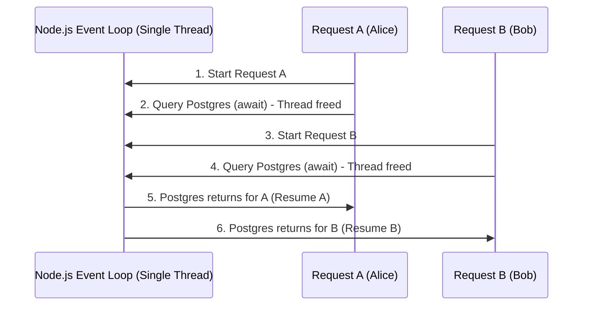
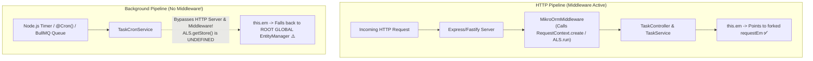

# Module 6: AsyncLocalStorage, Request Context, & Background Jobs in NestJS & MikroORM

A deep-dive guide for engineers explaining how Node.js manages execution-scoped context, how NestJS & MikroORM wire it together under the hood, and why background tasks (Crons/Queues) fail without proper isolation.

---

## 1. The Core Problem: Concurrency in a Single-Threaded Runtime

In multi-threaded server environments (like Java Spring or Python WSGI), every incoming HTTP request runs on a dedicated operating system thread:

```
Thread 1 (User Alice)   --> [ThreadLocal: DB Session A, User Alice] --> Controller --> Service --> DB
Thread 2 (User Bob)     --> [ThreadLocal: DB Session B, User Bob]   --> Controller --> Service --> DB
```

Because each thread has its own isolated memory bucket (`ThreadLocal`), functions anywhere deep in the code can simply call `getDbSession()` or `getCurrentUser()` without needing to pass variables through every layer.

### The Node.js Reality
Node.js runs your JavaScript code on a **single thread** using an **Event Loop**. When 100 HTTP requests hit your NestJS API simultaneously, Node.js does not create 100 threads. Instead, it interleaves execution across asynchronous I/O operations (`await`, database queries, file reads):



If we used a traditional global variable to store the "current database session" or "current user", Request B would overwrite Request A's data while Request A was waiting for PostgreSQL!

To solve this, Node.js introduced **`AsyncLocalStorage`** in the standard `node:async_hooks` module.

---

## 2. What is `AsyncLocalStorage`?

`AsyncLocalStorage` (ALS) creates an **asynchronous execution bubble**. Whatever data you put inside `als.run(data, callback)` follows that exact asynchronous call chain wherever it goes—across `await` statements, promises, callbacks, and microtasks.

---

## 3. Example 1: Simple Context Tracking (Tracing Request IDs)

Let's look at a pure Node.js example to see how ALS eliminates "parameter drilling".

### Without `AsyncLocalStorage` (Parameter Drilling ❌)
You must pass `requestId` through every function call in your codebase:
```typescript
async function handleRequest(requestId: string) {
  await stepOne(requestId);
}

async function stepOne(requestId: string) {
  await stepTwo(requestId);
}

async function stepTwo(requestId: string) {
  console.log(`[${requestId}] Saving data...`);
}
```

### With `AsyncLocalStorage` (Clean Context Propagation ✅)
```typescript
import { AsyncLocalStorage } from 'node:async_hooks';

// 1. Create the storage container
const requestStorage = new AsyncLocalStorage<{ requestId: string; userId: string }>();

// 2. A deep function anywhere in your app (zero parameter drilling!)
async function stepTwo() {
  const store = requestStorage.getStore(); // Magically retrieves context for THIS async chain!
  console.log(`[Request: ${store?.requestId}] [User: ${store?.userId}] Doing work...`);
}

async function stepOne() {
  await new Promise((resolve) => setTimeout(resolve, 50)); // Simulating async DB/Network
  await stepTwo();
}

// 3. Entry point: Wrap incoming request in an isolated ALS bubble
async function handleRequest(requestId: string, userId: string) {
  await requestStorage.run({ requestId, userId }, async () => {
    console.log(`Starting request ${requestId}`);
    await stepOne();
    console.log(`Finished request ${requestId}`);
  });
}

// Simulate two concurrent requests arriving at the same time:
handleRequest('req-101', 'alice');
handleRequest('req-202', 'bob');
```

**Console Output:**
```text
Starting request req-101
Starting request req-202
[Request: req-101] [User: alice] Doing work...
Finished request req-101
[Request: req-202] [User: bob] Doing work...
Finished request req-202
```
Even though both requests ran simultaneously on the exact same thread, each async chain preserved its own isolated context.

---

## 4. The Surrounding NestJS Code: How NestJS & MikroORM Wire This Up

In NestJS, almost all Services, Repositories, and Controllers are **Singletons** by default (only 1 instance of `TaskService` exists in memory for the entire life of the server).

How can a single singleton `TaskService` handle 1,000 different users without their database changes colliding?

### Step 1: The NestJS Middleware Registers `RequestContext`
When you import `MikroOrmModule.forRoot()` into your NestJS `AppModule`, MikroORM registers a global HTTP middleware:

```typescript
// What MikroORM's middleware does under the hood on every HTTP request:
import { Injectable, NestMiddleware } from '@nestjs/common';
import { Request, Response, NextFunction } from 'express';
import { EntityManager, RequestContext } from '@mikro-orm/postgresql';

@Injectable()
export class MikroOrmMiddleware implements NestMiddleware {
  constructor(private readonly rootEm: EntityManager) {}

  use(req: Request, res: Response, next: NextFunction) {
    // 1. Fork an isolated EntityManager for this specific HTTP request
    // 2. Wrap the request execution inside AsyncLocalStorage via RequestContext.create()
    RequestContext.create(this.rootEm, next);
  }
}
```

### Step 2: How `RequestContext.create` Uses `AsyncLocalStorage`
Under the hood in MikroORM's source code:
```typescript
export class RequestContext {
  private static storage = new AsyncLocalStorage<RequestContext>();

  static create(em: EntityManager, next: (...args: any[]) => void): void {
    const context = new RequestContext(em.fork()); // Creates a private work desk
    this.storage.run(context, next);               // Enters ALS bubble
  }

  static getEntityManager(): EntityManager | undefined {
    return this.storage.getStore()?.em;
  }
}
```

### Step 3: The Singleton Service & The Proxy `EntityManager`
In your NestJS service:
```typescript
@Injectable()
export class TaskService {
  constructor(
    // You inject this once when the application boots up
    private readonly em: EntityManager,
  ) {}

  async completeTask(taskId: string) {
    // When you call this.em, it is actually a PROXY that calls:
    // RequestContext.getEntityManager() -> ALS.getStore() -> The request's forked EntityManager!
    const task = await this.em.findOneOrFail(Task, { id: taskId });
    task.completed = true;
    await this.em.flush(); // Flushes ONLY the changes on this request's isolated desk!
  }
}
```

---

## 5. Why That Exact Setup Causes Bugs in Background Tasks (Crons & Queues)

Now, understand what happens when a **Background Task** runs:



### The Root Cause
1. NestJS Middleware **only intercepts incoming HTTP traffic** handled by the HTTP server (Express/Fastify).
2. `@Cron()`, `@Interval()`, BullMQ worker processors, or detached `setTimeout` calls are triggered directly by Node's timer queue or Redis socket events.
3. **No middleware ever runs for a Cron job.**
4. When your cron service executes and calls `this.em.find(...)`:
   - MikroORM calls `RequestContext.getEntityManager()`.
   - `AsyncLocalStorage.getStore()` returns `undefined` (because no one called `als.run()`).
   - **MikroORM falls back to using the Root Global `EntityManager`** that was created when the NestJS application first booted up!

---

## 6. The Three Disasters of Using the Root `EntityManager`

When a background job accidentally uses the shared Root `EntityManager`, three major bugs occur:

1. **Unbounded Memory Leak**: 
   The Root `EntityManager` never dies. Every database row loaded by every cron job every minute is cached in its Identity Map in memory forever. The server process will eventually crash with `JavaScript heap out of memory`.
2. **Ghost / Stale Data**:
   If Cron Run 1 loads `Task #10` (status: `PENDING`), it caches `Task #10` in memory. If a human user updates `Task #10` to `COMPLETED` via the API, Cron Run 2 (5 minutes later) will **not** query Postgres—it will read the old `PENDING` object from the root cache!
3. **Cross-Job Race Condition & Dirty Writes**:
   If two cron jobs or queue workers run simultaneously, calling `await this.em.flush()` in Job A will write whatever half-mutated entities Job B was currently modifying!

---

## 7. Example 2: Complex Real-World Scenario (The "Ghost Payment" Disaster)

Let's look at a realistic, complex scenario to see the failure in action and how to fix it cleanly.

### Scenario: A Subscription Renewal Cron Job
We have a cron job that runs every hour to renew expiring subscriptions, charge the user's balance, and create an invoice log.

### The Broken Implementation (Using Root `this.em` ❌)

```typescript
@Injectable()
export class SubscriptionCronService {
  constructor(
    private readonly em: EntityManager,
    private readonly paymentGateway: PaymentGateway,
  ) {}

  @Cron('0 * * * *')
  async renewSubscriptions() {
    // ❌ DANGER: No ALS context! All queries use the Root Global EntityManager.
    const expiringSubscriptions = await this.em.find(Subscription, {
      status: 'ACTIVE',
      expiresAt: { $lte: new Date() },
    }, { populate: ['user'] });

    for (const sub of expiringSubscriptions) {
      // 1. Charge user
      const chargeResult = await this.paymentGateway.charge(sub.user.emailId, sub.price);
      
      if (chargeResult.success) {
        sub.expiresAt = new Date(Date.now() + 30 * 24 * 60 * 60 * 1000);
        
        // 2. Create invoice
        const invoice = this.em.create(Invoice, {
          user: sub.user,
          subscription: sub,
          amount: sub.price,
          status: 'PAID',
        });
      } else {
        sub.status = 'PAST_DUE';
      }
    }

    // ❌ DANGER: If another background job (e.g. user cleanup) modified a User in memory,
    // this flush() commits their half-broken changes too!
    await this.em.flush();
  }
}
```

### What Happens in Production Without Forking?
* **Hour 1**: 100 subscriptions processed. 100 `Subscription` and `User` entities cached in Root EM.
* **Hour 2**: User Alice went to the web UI and changed her credit card. But the cron job loads Alice's `User` entity from the Root EM cache (Hour 1's state) instead of PostgreSQL, charging the expired card!
* **Hour 3**: 300 entities cached in RAM. Memory graph climbs steadily.
* **Hour 48**: Server crashes with Out-Of-Memory (OOM).

---

### The Fixed Implementation (Clean Isolation ✅)

#### Approach 1: Explicit `em.fork()` (Recommended for granular control / batch loops)

```typescript
@Injectable()
export class SubscriptionCronService {
  constructor(
    private readonly em: EntityManager,
    private readonly paymentGateway: PaymentGateway,
  ) {}

  @Cron('0 * * * *')
  async renewSubscriptions() {
    // 1. Fork a private, fresh EntityManager for this specific cron run
    const forkEm = this.em.fork();

    const expiringSubscriptions = await forkEm.find(Subscription, {
      status: 'ACTIVE',
      expiresAt: { $lte: new Date() },
    }, { populate: ['user'] });

    for (const sub of expiringSubscriptions) {
      const chargeResult = await this.paymentGateway.charge(sub.user.emailId, sub.price);
      
      if (chargeResult.success) {
        sub.expiresAt = new Date(Date.now() + 30 * 24 * 60 * 60 * 1000);
        
        forkEm.create(Invoice, {
          user: sub.user,
          subscription: sub,
          amount: sub.price,
          status: 'PAID',
        });
      } else {
        sub.status = 'PAST_DUE';
      }
    }

    // 2. Flushes ONLY the changes made on this isolated forkEm
    await forkEm.flush();

    // 3. When this method finishes, forkEm and all 100 objects are garbage collected!
  }
}
```

#### Approach 2: `@CreateRequestContext()` (Cleanest for simple methods)

```typescript
import { CreateRequestContext, EntityManager } from '@mikro-orm/postgresql';

@Injectable()
export class SubscriptionCronService {
  constructor(
    // In MikroORM, the method decorated with @CreateRequestContext needs this.em available on 'this'
    private readonly em: EntityManager,
    private readonly paymentGateway: PaymentGateway,
  ) {}

  @Cron('0 * * * *')
  @CreateRequestContext() // 👈 Automatically calls em.fork() and enters an ALS bubble!
  async renewSubscriptions() {
    // Inside this method, 'this.em' is automatically bound to the forked ALS context!
    const expiringSubscriptions = await this.em.find(Subscription, {
      status: 'ACTIVE',
      expiresAt: { $lte: new Date() },
    }, { populate: ['user'] });

    for (const sub of expiringSubscriptions) {
      const chargeResult = await this.paymentGateway.charge(sub.user.emailId, sub.price);
      
      if (chargeResult.success) {
        sub.expiresAt = new Date(Date.now() + 30 * 24 * 60 * 60 * 1000);
        
        this.em.create(Invoice, {
          user: sub.user,
          subscription: sub,
          amount: sub.price,
          status: 'PAID',
        });
      } else {
        sub.status = 'PAST_DUE';
      }
    }

    await this.em.flush();
  }
}
```

---

## 8. Summary Comparison

| Metric | HTTP Request (Normal Controller/Service) | Background Job WITHOUT Fork ❌ | Background Job WITH `em.fork()` ✅ |
| :--- | :--- | :--- | :--- |
| **Trigger Source** | Inbound HTTP via Express / Fastify | Timer / Cron / Queue worker | Timer / Cron / Queue worker |
| **HTTP Middleware Ran?** | **Yes** (`RequestContext.create`) | **No** (Bypassed) | **No** (Bypassed) |
| **`AsyncLocalStorage` Active?** | **Yes** | **No** (`undefined`) | **Yes** (Created by `fork()` or `@CreateRequestContext`) |
| **`EntityManager` Instance** | Request-scoped forked EM | **Root Global EM** (Shared!) | Dedicated forked EM |
| **Identity Map Cache** | Discarded after response | **Accumulates in RAM forever** | Discarded after job finishes |
| **Concurrency Safety** | 100% Safe (Isolated) | **Unsafe (Race conditions)** | 100% Safe (Isolated) |
