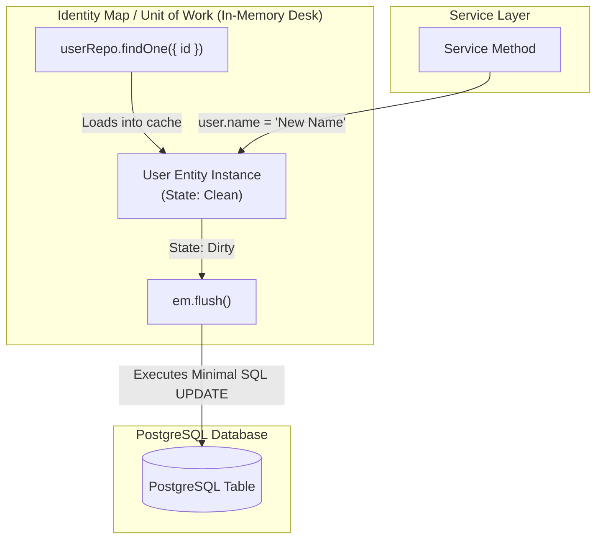
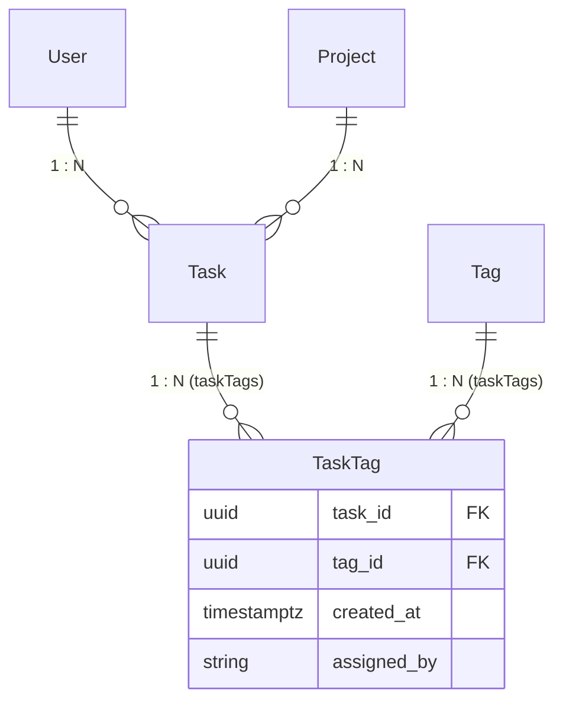

# Module 08: MikroORM v7 Complete Engineering Handbook

A comprehensive, production-ready guide to building scalable, type-safe persistence layers with **MikroORM v7**, **NestJS 11**, and **PostgreSQL**.

---

## 1. Architectural Philosophy & Mental Model

MikroORM is built on two core architectural patterns: **Data Mapper** and **Unit of Work** (with an **Identity Map**).



### Key Differences from Active Record (e.g. TypeORM / Prisma)
- **Entities are Plain Objects**: Entities do not have `.save()` or `.remove()` methods.
- **Identity Map Guarantees Single Instance**: Loading the same database row twice in the same request returns the exact same object reference in memory.
- **Batched Automatic Diffs**: You modify entity properties directly in TypeScript. Calling `await em.flush()` calculates dirty diffs and executes optimized, single-transaction SQL queries.

---

## 2. Defining Schemas: `defineEntity` & Property Builder `p`

In modern MikroORM v7, entity schemas are declared programmatically without experimental class decorators.

```typescript
// src/task/task.entity.ts
import { defineEntity, type InferEntity, p } from '@mikro-orm/core';
import { User } from '../user/user.entity';
import { Project } from '../project/project.entity';

export const Task = defineEntity({
  name: 'Task',
  tableName: 'tasks',
  properties: {
    id: p.uuid().primary(),
    title: p.string().fieldName('title').length(255),
    description: p.text().fieldName('description').nullable(),
    isCompleted: p.boolean().fieldName('is_completed'),
    priority: p.enum(['LOW', 'MEDIUM', 'HIGH']).fieldName('priority'),
    dueDate: p.datetime().fieldName('due_date').columnType('timestamptz').nullable(),

    // Relationships
    user: p
      .manyToOne(() => User)
      .fieldName('user_id')
      .inversedBy('tasks')
      .deleteRule('cascade'),

    project: p
      .manyToOne(() => Project)
      .fieldName('project_id')
      .inversedBy('tasks')
      .deleteRule('set null')
      .nullable(),

    // Explicit Application-Managed Timestamps
    createdAt: p.datetime().fieldName('created_at').columnType('timestamptz'),
    updatedAt: p.datetime().fieldName('updated_at').columnType('timestamptz'),
    deletedAt: p.datetime().fieldName('deleted_at').columnType('timestamptz').nullable(),
  },
  indexes: [
    { properties: ['user', 'deletedAt'] },
    { properties: ['project'] },
  ],
});

export type ITask = InferEntity<typeof Task>;
```

---

## 3. The "Dumb ORM & Dumb Database" Standard

To eliminate hidden database triggers, implicit side-effects, and time-drift bugs, this workspace mandates strict **Explicit Application Authority**:

| Area | Strict Rule | Why? |
| :--- | :--- | :--- |
| **Primary Keys (UUID)** | Generated via `crypto.randomUUID()` in the application service. | Full control over entity IDs before persistence, deterministic testing, no DB roundtrip dependencies. |
| **Timestamps** | `createdAt`, `updatedAt`, `deletedAt` set explicitly with `new Date()`. | Avoids clock skew between DB server and application node, allows precise mock time in unit tests. |
| **Defaults** | Booleans (`false`), enums (`'PENDING'`) passed explicitly in create payloads. | Eliminates implicit schema defaults and hidden fallback behavior. |
| **Lifecycle Hooks** | Never use `.onCreate()`, `.onUpdate()`, or property hooks. | Preserves pure functional data mapping without hidden mutations. |
| **DDL Schemas** | No `DEFAULT NOW()` or `DEFAULT gen_random_uuid()` in SQL migrations. | Ensures DB schema remains a pure dumb storage engine. |

---

## 4. Entity Relationships & Explicit Pivot Tables



### The Explicit Pivot Entity Standard (Many-to-Many)
Never use implicit `p.manyToMany` join tables. Decompose all M:N relationships into two 1:N relations with a dedicated join entity:

```typescript
// src/task/task-tag.entity.ts
import { defineEntity, type InferEntity, p } from '@mikro-orm/core';
import { Task } from './task.entity';
import { Tag } from '../tag/tag.entity';

export const TaskTag = defineEntity({
  name: 'TaskTag',
  tableName: 'task_tags',
  primaryKeys: ['task', 'tag'], // Composite PK
  properties: {
    task: p
      .manyToOne(() => Task)
      .fieldName('task_id')
      .inversedBy('taskTags')
      .deleteRule('cascade'),

    tag: p
      .manyToOne(() => Tag)
      .fieldName('tag_id')
      .inversedBy('taskTags')
      .deleteRule('cascade'),

    createdAt: p.datetime().fieldName('created_at').columnType('timestamptz'),
    assignedBy: p.string().fieldName('assigned_by').length(255).nullable(),
  },
});

export type ITaskTag = InferEntity<typeof TaskTag>;
```

---

## 5. Everyday CRUD & Repository Operations

In NestJS, inject `EntityRepository<T>` and `EntityManager`:

```typescript
import { Injectable, NotFoundException } from '@nestjs/common';
import { InjectRepository } from '@mikro-orm/nestjs';
import { EntityRepository, EntityManager } from '@mikro-orm/postgresql';
import { Task, type ITask } from './task.entity';
import { User, type IUser } from '../user/user.entity';

@Injectable()
export class TaskService {
  constructor(
    @InjectRepository(Task)
    private readonly taskRepo: EntityRepository<ITask>,
    @InjectRepository(User)
    private readonly userRepo: EntityRepository<IUser>,
    private readonly em: EntityManager,
  ) {}

  // CREATE
  async create(userId: string, title: string, priority: 'LOW' | 'MEDIUM' | 'HIGH'): Promise<ITask> {
    const userRef = this.userRepo.getReference(userId);
    const now = new Date();

    const task = this.taskRepo.create({
      id: crypto.randomUUID(),
      title,
      description: null,
      isCompleted: false,
      priority,
      dueDate: null,
      user: userRef,
      project: null,
      createdAt: now,
      updatedAt: now,
      deletedAt: null,
    });

    await this.em.flush();
    return task;
  }

  // READ (With Population)
  async findById(taskId: string): Promise<ITask> {
    const task = await this.taskRepo.findOne(
      { id: taskId, deletedAt: null },
      { populate: ['user', 'project'] },
    );
    if (!task) throw new NotFoundException('Task not found');
    return task;
  }

  // UPDATE (In-Memory Mutation)
  async update(taskId: string, dto: { title?: string; isCompleted?: boolean }): Promise<ITask> {
    const task = await this.taskRepo.findOneOrFail({ id: taskId, deletedAt: null });

    if (dto.title !== undefined) task.title = dto.title;
    if (dto.isCompleted !== undefined) task.isCompleted = dto.isCompleted;
    task.updatedAt = new Date();

    await this.em.flush();
    return task;
  }

  // SOFT DELETE
  async softDelete(taskId: string): Promise<void> {
    const task = await this.taskRepo.findOneOrFail({ id: taskId, deletedAt: null });
    task.deletedAt = new Date();
    task.updatedAt = new Date();
    await this.em.flush();
  }

  // HARD DELETE
  async hardDelete(taskId: string): Promise<void> {
    const task = await this.taskRepo.findOneOrFail({ id: taskId });
    await this.em.removeAndFlush(task);
  }
}
```

---

## 6. QueryBuilder & Advanced Dynamic Queries

```typescript
async searchTasks(userId: string, filters: {
  search?: string;
  priority?: string;
  isCompleted?: boolean;
  limit?: number;
  offset?: number;
}) {
  const qb = this.taskRepo.createQueryBuilder('t')
    .select('*')
    .leftJoinAndSelect('t.project', 'p')
    .where({ 't.user': userId, 't.deletedAt': null });

  if (filters.priority) {
    qb.andWhere({ 't.priority': filters.priority });
  }

  if (filters.isCompleted !== undefined) {
    qb.andWhere({ 't.isCompleted': filters.isCompleted });
  }

  if (filters.search) {
    qb.andWhere({
      $or: [
        { 't.title': { $ilike: `%${filters.search}%` } },
        { 't.description': { $ilike: `%${filters.search}%` } },
      ],
    });
  }

  qb.orderBy({ 't.createdAt': 'DESC' })
    .limit(filters.limit ?? 20)
    .offset(filters.offset ?? 0);

  const [items, total] = await qb.getResultAndCount();
  return { items, total };
}
```

---

## 7. Atomic Transactions (`em.transactional`)

```typescript
async reassignTasks(fromUserId: string, toUserId: string): Promise<number> {
  return await this.em.transactional(async (txEm) => {
    const targetUser = await txEm.findOneOrFail(User, { id: toUserId, deletedAt: null });
    const tasks = await txEm.find(Task, { user: fromUserId, deletedAt: null });

    const now = new Date();
    for (const task of tasks) {
      task.user = targetUser;
      task.updatedAt = now;
    }

    // Creating audit record within the same transaction
    txEm.create(AuditLog, {
      id: crypto.randomUUID(),
      action: 'TASKS_BULK_REASSIGNED',
      details: { fromUserId, toUserId, count: tasks.length },
      createdAt: now,
    });

    return tasks.length;
  });
}
```

---

## 8. NestJS 11 Setup & Request Context (`AsyncLocalStorage`)

### Root Module Configuration (`app.module.ts`)
```typescript
import { Module } from '@nestjs/common';
import { ConfigModule, ConfigService } from '@nestjs/config';
import { MikroOrmModule } from '@mikro-orm/nestjs';
import { defineConfig, PostgreSqlDriver } from '@mikro-orm/postgresql';
import { User } from './user/user.entity';
import { Task } from './task/task.entity';
import { Project } from './project/project.entity';
import { Tag } from './tag/tag.entity';
import { TaskTag } from './task/task-tag.entity';

@Module({
  imports: [
    ConfigModule.forRoot({ isGlobal: true }),
    MikroOrmModule.forRootAsync({
      imports: [ConfigModule],
      inject: [ConfigService],
      driver: PostgreSqlDriver,
      useFactory: (config: ConfigService) => defineConfig({
        driver: PostgreSqlDriver,
        host: config.get<string>('DB_HOST'),
        port: config.get<number>('DB_PORT'),
        user: config.get<string>('DB_USERNAME'),
        password: config.get<string>('DB_PASSWORD'),
        dbName: config.get<string>('DB_NAME'),
        entities: [User, Task, Project, Tag, TaskTag],
        debug: config.get<string>('NODE_ENV') === 'development',
      }),
    }),
  ],
})
export class AppModule {}
```

### Background Tasks & Crons Isolation
```typescript
import { Injectable } from '@nestjs/common';
import { Cron } from '@nestjs/schedule';
import { CreateRequestContext, EntityManager } from '@mikro-orm/postgresql';
import { Task } from './task.entity';

@Injectable()
export class TaskCronService {
  constructor(private readonly em: EntityManager) {}

  @Cron('0 0 * * *')
  @CreateRequestContext()
  async purgeOldSoftDeletedTasks() {
    const cutoff = new Date(Date.now() - 30 * 24 * 60 * 60 * 1000);
    const oldTasks = await this.em.find(Task, {
      deletedAt: { $ne: null, $lt: cutoff },
    });

    for (const task of oldTasks) {
      this.em.remove(task);
    }
    await this.em.flush();
  }
}
```

---

## 9. MikroORM CLI & Migrations

### CLI Configuration (`mikro-orm.config.ts`)
```typescript
import { defineConfig, PostgreSqlDriver } from '@mikro-orm/postgresql';
import { User } from './src/user/user.entity';
import { Task } from './src/task/task.entity';
import { Project } from './src/project/project.entity';
import { Tag } from './src/tag/tag.entity';
import { TaskTag } from './src/task/task-tag.entity';

export default defineConfig({
  driver: PostgreSqlDriver,
  host: process.env.DB_HOST ?? 'localhost',
  port: Number(process.env.DB_PORT ?? 5432),
  user: process.env.DB_USERNAME ?? 'postgres',
  password: process.env.DB_PASSWORD ?? 'postgres',
  dbName: process.env.DB_NAME ?? 'todo_db',
  entities: [User, Task, Project, Tag, TaskTag],
  migrations: {
    path: './migrations',
    pathTs: './migrations',
    transactional: true,
    allOrNothing: true,
  },
});
```

### Essential CLI Commands
| Action | Command |
| :--- | :--- |
| **Generate Migration** | `npx mikro-orm migration:create` |
| **Apply Migrations** | `npx mikro-orm migration:up` |
| **Rollback Migration** | `npx mikro-orm migration:down` |
| **Check Schema Status**| `npx mikro-orm schema:debug` |
| **Update Schema (Dev)**| `npx mikro-orm schema:update --run` |

---

## 10. Top 5 Gotchas & Debugging Techniques

1. **Forgetting `await em.flush()`**:
   - *Symptom*: Entities are created or mutated in code, but no SQL runs and database is unchanged.
   - *Fix*: Always call `await this.em.flush()` to sync the Identity Map with PostgreSQL.
2. **Querying by DB Column Name Instead of Property Name**:
   - *Symptom*: Query fails or ignores filters (`{ first_name: 'John' }`).
   - *Fix*: Always use TypeScript property names (`{ firstName: 'John' }`).
3. **Missing `populate` on Relation Access**:
   - *Symptom*: `task.project.name` is undefined or throws an error.
   - *Fix*: Pass `{ populate: ['project'] }` when querying or use `await em.populate(task, ['project'])`.
4. **Shared Root EM in Background Workers**:
   - *Symptom*: Memory leaks or cross-request dirty entity flushes in crons.
   - *Fix*: Annotate cron methods with `@CreateRequestContext()` or manually call `this.em.fork()`.
5. **Direct Mutation of Inactive Soft-Deleted Records**:
   - *Symptom*: Updating records that were previously soft-deleted without resetting `deletedAt`.
   - *Fix*: Always include `deletedAt: null` in query conditions unless explicitly handling soft-deleted items.

---

## 11. MikroORM v7 Engine Architecture & Official Docs Highlights

Based on the official MikroORM v7 ("Unchained") documentation and upgrading specifications:

### 1. Native ECMAScript Modules (ESM)
- MikroORM v7 is fully packaged as native ESM with extensive `package.json` `exports` maps.
- **`tsconfig.json` Mandate**: In NestJS and TypeScript applications, set `moduleResolution: "nodenext"` or `"bundler"` (legacy `moduleResolution: "node"` / `node10` causes type resolution failures with driver packages).
- **Node & TS Requirements**: Node.js 22.17+ and TypeScript 5.8+ are required.

### 2. `forceUtcTimezone` Enabled by Default
- In MikroORM v7, `forceUtcTimezone` is enabled by default for all SQL drivers (including PostgreSQL).
- Datetime values without timezone information are automatically converted to UTC upon persistence and retrieval.
- For explicit timezone handling, specify `timestamptz` column types in property builders: `p.datetime().columnType('timestamptz')`.

### 3. Kysely as the Underlying Query Engine
- Knex has been completely removed in v7 and replaced with **Kysely** for robust, modern query compilation and execution.
- QueryBuilder in MikroORM v7 continues to provide the high-level API while benefiting from Kysely's modern SQL engine under the hood.

### 4. Decorators Decoupled & `defineEntity` as Modern Standard
- Decorators were moved out of `@mikro-orm/core` into the dedicated `@mikro-orm/decorators` package.
- The official recommended standard for new applications is the programmatic **`defineEntity`** API with property builder **`p`**, eliminating experimental decorator requirements and providing instant TypeScript type inference.

### 5. Zero Core Runtime Dependencies
- `@mikro-orm/core` has zero runtime dependencies and no longer automatically reads `.env` files.
- Environment variables must be loaded explicitly via `@nestjs/config` (`ConfigService`) or `dotenv.config()`.

