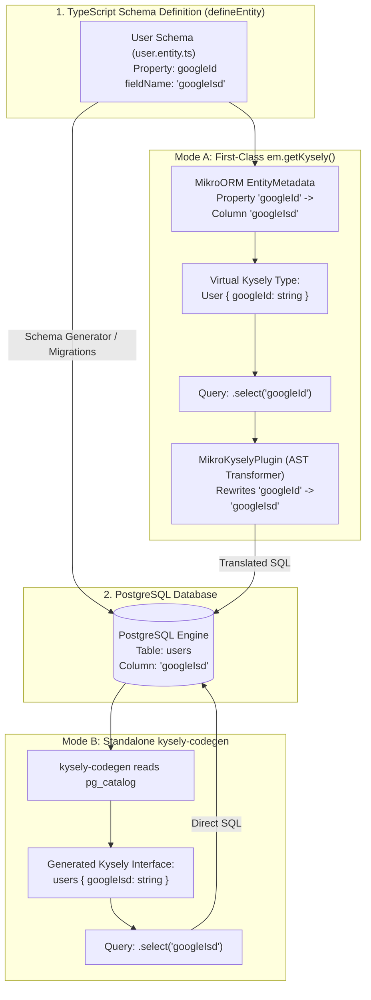

# Mental Model: MikroORM & Kysely Integration

This guide details what happens under the hood when using **Kysely** with **MikroORM v7+**.

There are two fundamentally different ways to use Kysely with MikroORM:
1. **Mode A: First-Class Integration (`em.getKysely()`)** *(Metadata-Aware AST Translation via `MikroKyselyPlugin` & `defineEntity`)*
2. **Mode B: Standalone Kysely (`kysely-codegen`)** *(Direct PostgreSQL System Catalog Introspection)*

---

## 1. High-Level Architecture Comparison



---

## 2. Mode A: First-Class Integration (`em.getKysely()`)

> 💡 **Version Context**: Native Kysely integration (`em.getKysely()` and `MikroKyselyPlugin`) is built directly into `@mikro-orm/core` and SQL drivers in **MikroORM v7+** (where Kysely officially replaced Knex as the default SQL query execution engine).

When using MikroORM's first-class Kysely integration, MikroORM wraps Kysely into its metadata, hook, and transaction lifecycle:

```typescript
const kysely = em.getKysely({
  tableNamingStrategy: 'entity',     // Query by entity name 'User' instead of table 'users'
  columnNamingStrategy: 'property',  // Query by property name 'googleId' instead of column 'googleIsd'
  processOnCreateHooks: true,        // Automatically trigger onCreate hooks
  processOnUpdateHooks: true,        // Automatically trigger onUpdate hooks
  convertValues: true,               // Run MikroORM custom type value converters
});

const rows = await kysely
  .selectFrom('User')
  .select(['id', 'googleId'])
  .where('googleId', '=', 'google_oauth_123')
  .execute();
```

### What Happens Under the Hood in Mode A:

#### 1. Compile-Time Type Inference with `defineEntity`
* **Zero Boilerplate Type Inference**: When entities are defined using `defineEntity()`, Kysely's type inference works **automatically** without requiring extra symbols or manual interface mappings:
  ```typescript
  import { defineEntity, type InferEntity, p } from '@mikro-orm/core';

  export const User = defineEntity({
    name: 'User',
    tableName: 'users',
    properties: {
      id: p.uuid().primary(),
      googleId: p.string().fieldName('googleIsd').unique(),
    },
  });

  export type IUser = InferEntity<typeof User>;
  ```
* Because `columnNamingStrategy: 'property'` is configured, autocomplete and typechecking expect **`googleId`** (the TypeScript property), not `googleIsd`.

#### 2. Query AST Transformation at Runtime (`MikroKyselyPlugin`)
When you write `.select(['googleId'])` and `.where('googleId', '=', ...)`, Kysely builds an Abstract Syntax Tree (AST) representing the query.
* Before emitting SQL to PostgreSQL, MikroORM's internal **`MikroKyselyPlugin`** intercepts the query AST.
* It consults the entity metadata map:
  $$\text{Table: } \mathtt{'User'} \longrightarrow \mathtt{"users"}$$
  $$\text{Field: } \mathtt{'googleId'} \longrightarrow \mathtt{"googleIsd"}$$
  $$\text{Field: } \mathtt{'firstName'} \longrightarrow \mathtt{"first_name"}$$
* The transformer dynamically rewrites identifiers in the SQL AST before query compilation.

#### 3. Execution against PostgreSQL
The physical SQL sent over the wire is:
```sql
SELECT "u"."id", "u"."googleIsd"
FROM "users" AS "u"
WHERE "u"."googleIsd" = $1;
```
PostgreSQL executes the query against `"googleIsd"`, finding the correct physical column.

#### 4. Automatic Result Transformation & Value Conversion
When rows return from PostgreSQL (`{ id: '...', googleIsd: '...' }`), MikroORM:
1. Maps physical column names back to TypeScript schema property names.
2. Applies custom property type converters (when `convertValues: true`).

```typescript
// Result returned to your application code:
[
  { id: '9b1deb4d-...', googleId: 'google_oauth_123' }
]
```

#### 5. Transaction Participation
If `em.getKysely()` is called inside `em.transactional()` or after `em.begin()`, the returned Kysely instance automatically participates in that active database transaction.

> 🎯 **Answer to the deliberate typo scenario**:
> In **Mode A**, the typo `fieldName: 'googleIsd'` is completely managed by MikroORM. You write `googleId` in TypeScript, MikroORM rewrites it to `googleIsd` for PostgreSQL, and maps it back to `googleId` in the result. Everything typechecks and runs without errors.

---

## 3. Mode B: Standalone Kysely (`kysely-codegen`)

If you use Kysely independently (without `em.getKysely()`), you generate types by running `kysely-codegen` directly against PostgreSQL.

### What Happens Under the Hood in Mode B:

1. `kysely-codegen` connects to PostgreSQL and inspects `information_schema.columns` / `pg_catalog`. It **does not read TypeScript schema files**.
2. It sees column `"googleIsd"` on table `"users"`.
3. It generates:
   ```typescript
   export interface Users {
     id: string;
     googleIsd: string; // Direct reflection of Postgres catalog
   }
   ```
4. Querying requires using the raw DB column name:
   ```typescript
   // In standalone Kysely:
   const rows = await db
     .selectFrom('users')
     .select(['id', 'googleIsd']) // Must use 'googleIsd'
     .execute();
   ```
5. **`CamelCasePlugin` Limitations**: Kysely's built-in `CamelCasePlugin` only converts standard `snake_case` $\leftrightarrow$ `camelCase` (e.g. `first_name` $\leftrightarrow$ `firstName`). It cannot know arbitrary renames or custom typos like `googleIsd` $\leftrightarrow$ `googleId`.

---

## 4. Summary: Mode A vs. Mode B

| Feature | Mode A: First-Class `em.getKysely()` | Mode B: Standalone Kysely (`kysely-codegen`) |
| :--- | :--- | :--- |
| **Engine Availability** | Built into `@mikro-orm/core` (MikroORM v7+) | Standalone NPM CLI (`kysely-codegen`) |
| **Type Source** | MikroORM Entity Metadata (`EntityMetadata`) | Live PostgreSQL System Catalog (`pg_catalog`) |
| **Schema Definition** | Automatic with `defineEntity()` & `InferEntity` | Direct from PostgreSQL system catalog |
| **Identifiers in Code** | Schema & Property names (`User`, `googleId`) | Table & Column names (`users`, `googleIsd`) |
| **Typo / Rename Handling (`googleIsd`)** | Abstracted away via `MikroKyselyPlugin` AST rewriting | Exposes `googleIsd` directly in types & queries |
| **Transaction Context** | Automatically participates in `em.transactional()` | Requires manual Kysely transaction management |
| **Result Mapping** | Maps DB columns back to TS properties | Returns raw DB column keys |
| **Lifecycle Hooks & Converters** | Supports `processOnCreateHooks`, `convertValues` | Raw SQL without ORM lifecycle hooks or converters |
