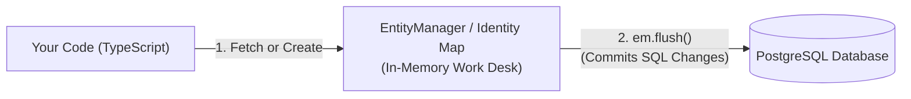

# Practical Guide: MikroORM in NestJS (Layman's Handbook)

This guide provides a straightforward, practical mental model for building features with **MikroORM v7** and **PostgreSQL** in NestJS without needing additional query builder libraries.

---

## 1. The 2-Minute Mental Model: How MikroORM Works

Think of MikroORM as having **two core parts**:



1. **Entities are Defined Programmatically via `defineEntity`**: Instead of relying on legacy experimental class decorators, modern MikroORM uses **`defineEntity`**, **`InferEntity`**, and property builder **`p`**.
2. **The "Work Desk" (Unit of Work & Identity Map)**:
   - When you load an entity from the database, MikroORM keeps a copy on its "work desk" (Identity Map).
   - You modify properties directly in normal TypeScript: `task.title = 'Updated Title'`.
   - When you call **`await this.em.flush()`**, MikroORM looks at what changed on your work desk and automatically writes the exact SQL `UPDATE` statement to PostgreSQL.
   - You **do not** call `task.save()`. You use `userRepo.create(item)` (or `em.persist(item)`) to stage a *new* item on the desk, and `em.flush()` to send changes to PostgreSQL.

---

## 2. Defining Schemas with `defineEntity` & `p`

In modern MikroORM v7, schema definitions are concise, type-safe, and require zero decorators:

```typescript
// src/user/user.entity.ts
import { defineEntity, type InferEntity, p } from '@mikro-orm/core';

export const User = defineEntity({
  name: 'User',
  tableName: 'users',
  properties: {
    id: p.uuid().primary(),
    firstName: p.string().fieldName('first_name').length(255),
    lastName: p.string().fieldName('last_name').length(255).nullable(),
    googleId: p.string().fieldName('google_id').length(255).unique(),
    emailId: p.string().fieldName('email_id').length(255).unique(),
    createdAt: p
      .datetime()
      .fieldName('created_at')
      .columnType('timestamptz'),
    updatedAt: p
      .datetime()
      .fieldName('updated_at')
      .columnType('timestamptz'),
    deletedAt: p
      .datetime()
      .fieldName('deleted_at')
      .columnType('timestamptz')
      .nullable(),
  },
});

// Infer the TypeScript interface automatically
export type IUser = InferEntity<typeof User>;
```

---

## 2.1 Defining Relationships & Explicit Pivot Entities (Standard)

*(For a dedicated, comprehensive breakdown, see [mikroorm_relationships_and_pivot_entities.md](file:///home/ansh/Projects/TODOApp/guides/mikroorm_relationships_and_pivot_entities.md).)*

In modern MikroORM v7, relationship mapping is done cleanly on the `p` builder without decorators.

### A. One-to-Many & Many-to-One (1:N)
The owning side (`Task`) defines `p.manyToOne` with `.fieldName('user_id')` and `.deleteRule('cascade')`. The parent side (`User`) defines `p.oneToMany` with `.mappedBy('user')`:

```typescript
// Child / Owning Side
export const Task = defineEntity({
  name: 'Task',
  tableName: 'tasks',
  properties: {
    id: p.uuid().primary(),
    title: p.string().length(255),
    user: p
      .manyToOne(() => User)
      .fieldName('user_id')
      .inversedBy('tasks')
      .deleteRule('cascade'),
  },
});

// Parent / Inverse Side
export const User = defineEntity({
  name: 'User',
  tableName: 'users',
  properties: {
    id: p.uuid().primary(),
    tasks: p.oneToMany(() => Task).mappedBy('user'),
  },
});
```

---

### B. Many-to-Many: The Explicit Pivot Entity Standard (Approach 1)

> 💡 **Best Practice Mandate**: Do not use implicit `p.manyToMany` join tables. Real-world applications require metadata columns (`createdAt`, `assignedBy`), direct queryability, and explicit DB index control. **Always decompose Many-to-Many relationships into two `1:N` relations with a dedicated Join Entity.**

```typescript
// 1. Explicit Pivot Entity (src/task/task-tag.entity.ts)
export const TaskTag = defineEntity({
  name: 'TaskTag',
  tableName: 'task_tags',
  primaryKeys: ['task', 'tag'], // Composite Primary Key
  properties: {
    task: p
      .manyToOne(() => Task)
      .fieldName('task_id')
      .inversedBy('taskTags')
      .deleteRule('cascade'),

    tag: p
      .manyToOne(() => Tag)
      .fieldName('tag_id')
      .inversedBy('taskTags')
      .deleteRule('cascade'),

    // ✨ Explicit pivot payload / metadata
    createdAt: p
      .datetime()
      .fieldName('created_at')
      .columnType('timestamptz'),

    assignedBy: p
      .string()
      .fieldName('assigned_by')
      .length(255)
      .nullable(),
  },
});

export type ITaskTag = InferEntity<typeof TaskTag>;
```

```typescript
// 2. Task Entity (src/task/task.entity.ts)
export const Task = defineEntity({
  name: 'Task',
  tableName: 'tasks',
  properties: {
    id: p.uuid().primary(),
    title: p.string().length(255),
    taskTags: p.oneToMany(() => TaskTag).mappedBy('task'),
  },
});

// 3. Tag Entity (src/tag/tag.entity.ts)
export const Tag = defineEntity({
  name: 'Tag',
  tableName: 'tags',
  properties: {
    id: p.uuid().primary(),
    name: p.string().length(50).unique(),
    taskTags: p.oneToMany(() => TaskTag).mappedBy('tag'),
  },
});
```

#### Working with the Explicit Pivot Entity:
```typescript
// 1. Linking a task and tag with metadata:
this.taskTagRepo.create({
  task,
  tag,
  assignedBy: currentUser.id,
  createdAt: new Date(),
});
await this.em.flush();

// 2. Querying with nested population:
const task = await this.taskRepo.findOne(
  { id: taskId },
  { populate: ['taskTags.tag'] },
);

// 3. Unlinking without deleting Task or Tag:
const link = await this.taskTagRepo.findOne({ task: taskId, tag: tagId });
if (link) await this.em.removeAndFlush(link);
```

---

## 3. Everyday Operations: The 90% You Will Use

In NestJS, you inject the entity schema's `EntityRepository` and the `EntityManager` directly into your service:

```typescript
import { Injectable } from '@nestjs/common';
import { InjectRepository } from '@mikro-orm/nestjs';
import { EntityRepository, EntityManager } from '@mikro-orm/postgresql';
import { User, type IUser } from './user.entity';

@Injectable()
export class UserService {
  constructor(
    @InjectRepository(User)
    private readonly userRepo: EntityRepository<IUser>,
    private readonly em: EntityManager,
  ) {}
}
```

### The 4 Basic CRUD Actions:

```typescript
// 1. CREATE
const newUser = this.userRepo.create({
  firstName: 'Alice',
  googleId: 'oauth_123',
  emailId: 'alice@example.com',
  createdAt: new Date(),
  updatedAt: new Date(),
});
await this.em.flush(); // Persists and writes to PostgreSQL

// 2. READ (Find One or Many)
const user = await this.userRepo.findOne({ id: userId });
const activeUsers = await this.userRepo.find({ deletedAt: null });

// 3. UPDATE
const userToUpdate = await this.userRepo.findOneOrFail({ id: userId });
userToUpdate.firstName = 'Alicia';
await this.em.flush(); // MikroORM detects the property mutation and executes SQL UPDATE

// 4. DELETE
// Soft Delete (Recommended):
userToUpdate.deletedAt = new Date();
await this.em.flush();

// Hard Delete (Permanent database removal):
await this.em.removeAndFlush(userToUpdate);
```

---

## 4. Dynamic Queries & Query Builder

When building search bars, multi-filter dropdowns, sorting, or pagination, you have two approaches:

### Option A: Clean Object Queries (Best for standard dynamic filtering)
MikroORM lets you pass plain objects with operators (like `$ilike`, `$in`, `$gte`, `$lte`):

```typescript
async findTasks(userId: string, filters: { status?: string; search?: string }) {
  const whereClause: any = {
    user: userId,
    deletedAt: null,
  };

  if (filters.status) {
    whereClause.status = filters.status;
  }

  if (filters.search) {
    whereClause.title = { $ilike: `%${filters.search}%` }; // Case-insensitive SQL LIKE
  }

  return await this.taskRepo.find(whereClause, {
    orderBy: { createdAt: 'DESC' },
    limit: 20,
    offset: 0,
  });
}
```

---

### Option B: Built-in QueryBuilder (Best for complex joins & dynamic WHERE chains)
You can get a QueryBuilder directly from the repository or EntityManager using **`createQueryBuilder()`** (or `qb()`):

```typescript
async searchTasksDynamic(userId: string, params: {
  status?: string;
  search?: string;
  projectName?: string;
  limit?: number;
  offset?: number;
}) {
  // 1. Initialize query builder with an alias 't'
  const qb = this.taskRepo.createQueryBuilder('t')
    .select('*')
    .leftJoinAndSelect('t.project', 'p') // Joins and hydrates project relation
    .where({ 't.user': userId, 't.deletedAt': null });

  // 2. Conditionally append dynamic WHERE clauses
  if (params.status) {
    qb.andWhere({ 't.status': params.status });
  }

  if (params.search) {
    qb.andWhere({ 't.title': { $ilike: `%${params.search}%` } });
  }

  if (params.projectName) {
    qb.andWhere({ 'p.name': { $ilike: `%${params.projectName}%` } });
  }

  // 3. Add pagination and sorting
  qb.orderBy({ 't.createdAt': 'DESC' })
    .limit(params.limit ?? 10)
    .offset(params.offset ?? 0);

  // 4. Execute query (returns typed entity instances and total matching count)
  const [tasks, totalCount] = await qb.getResultAndCount();

  return { tasks, totalCount };
}
```

---

## 5. The 4 "Golden Rules" to Prevent 99% of Bugs

If things ever seem "broken" or behave unexpectedly, check these four areas:

### 1. Remember `await em.flush()`
* Calling `this.userRepo.create(...)` or updating a property (`user.firstName = 'Bob'`) only modifies memory.
* **SQL queries are sent to PostgreSQL only when you call `await this.em.flush()`**.
* *Symptom of forgetting*: Your code executes without error, but PostgreSQL has no new or updated rows.

### 2. Always Use TypeScript Property Names in Queries
* In your queries, write `{ firstName: 'John' }` (the TypeScript schema property).
* **Do NOT write** `{ first_name: 'John' }` (the database column).
* MikroORM's metadata map translates property names to column names in SQL automatically.

### 3. Loading Relations & Type Safety (`Loaded<T, P>`)
* In `defineEntity`, relationships are mapped cleanly using property builders:
  ```typescript
  export const Task = defineEntity({
    name: 'Task',
    properties: {
      id: p.uuid().primary(),
      project: () => p.manyToOne(Project),
    },
  });
  ```
* When querying, MikroORM's return type is **`Loaded<Task, P>`**, where `P` tracks the populated fields:
  ```typescript
  // Without populate -> Type is Loaded<ITask, never>
  const task = await this.taskRepo.findOne({ id });
  // task.project.id is accessible (FK is known), but non-PK fields require population!

  // With populate -> Type is Loaded<ITask, 'project'>
  const taskWithProject = await this.taskRepo.findOne({ id }, { populate: ['project'] });
  // TypeScript compiler now knows `taskWithProject.project.name` is loaded and safe to access!
  ```

### 4. Background Jobs & Timers: Request Context & `em.fork()`
*(For a comprehensive architectural breakdown and complex production failure scenarios, see [Module 6: AsyncLocalStorage & Request Context](file:///home/ansh/Projects/TODOApp/guides/06_async_local_storage_and_request_context.md).)*

#### Why Background Tasks Need Special Handling (`AsyncLocalStorage`)
MikroORM tracks entities in memory using an **Identity Map** (the "work desk"). To keep concurrent operations isolated without manually passing context objects through every service function:

1. **HTTP Requests (Automatic Isolation)**:
   - When an HTTP request enters NestJS, MikroORM's middleware creates a request-scoped `EntityManager` (`rootEm.fork()`) and wraps the call chain in Node's **`AsyncLocalStorage`** (ALS) via `RequestContext.create()`.
   - Every service or repository calling `this.em` automatically resolves to that request's private `EntityManager` via `als.getStore()`.
   - When the HTTP response finishes, the context closes and all cached entities are garbage collected.

2. **Background Tasks / Crons (No Automatic Context)**:
   - Tasks running outside the HTTP lifecycle (`@Cron()`, BullMQ workers, `setInterval`, or detached promises) never trigger the HTTP middleware.
   - Because no ALS store exists (`als.getStore() === undefined`), MikroORM falls back to the **Global Root `EntityManager`**.
   - **Root EntityManager hazards**:
     - **Memory Leaks**: Every entity loaded across all cron runs stays cached in root memory forever.
     - **Stale Data**: Subsequent runs return stale in-memory objects rather than fresh database records.
     - **Cross-Job State Pollution**: Calling `await this.em.flush()` in one worker flushes dirty, half-modified entities from any other worker sharing the root EM.

#### How to Handle Background Tasks

**Option A: Manual Forking (`this.em.fork()`)**
```typescript
@Injectable()
export class TaskCronService {
  constructor(private readonly em: EntityManager) {}

  @Cron('0 * * * *')
  async cleanupOldTasks() {
    // 1. Obtain a fresh, isolated EntityManager
    const forkEm = this.em.fork();

    // 2. Perform all queries and mutations on the forked instance
    const oldTasks = await forkEm.find(Task, { status: 'ARCHIVED' });
    for (const task of oldTasks) {
      task.deletedAt = new Date();
    }

    // 3. Flush changes isolated to this work desk
    await forkEm.flush();
  }
}
```

**Option B: Automatic ALS Wrapping (`@CreateRequestContext()`)**
```typescript
import { CreateRequestContext, EntityManager } from '@mikro-orm/postgresql';

@Injectable()
export class TaskCronService {
  constructor(private readonly em: EntityManager) {}

  @Cron('0 * * * *')
  @CreateRequestContext() // Wraps method execution in an ALS bubble with a forked EM automatically
  async cleanupOldTasks() {
    const oldTasks = await this.em.find(Task, { status: 'ARCHIVED' });
    for (const task of oldTasks) {
      task.deletedAt = new Date();
    }
    await this.em.flush();
  }
}
```

#### Comparison Matrix

| Execution Context | `AsyncLocalStorage` Active? | Resolved `this.em` | Action Needed |
| :--- | :--- | :--- | :--- |
| **HTTP Request** (Controller $\rightarrow$ Service) | **Yes** (created by HTTP middleware) | Request-scoped private `EntityManager` | None (use `this.em` and repositories normally) |
| **Background Task** (Cron, Queue, Timers) | **No** (unless wrapped) | Global Root `EntityManager` ⚠️ | Use `this.em.fork()` or `@CreateRequestContext()` |
