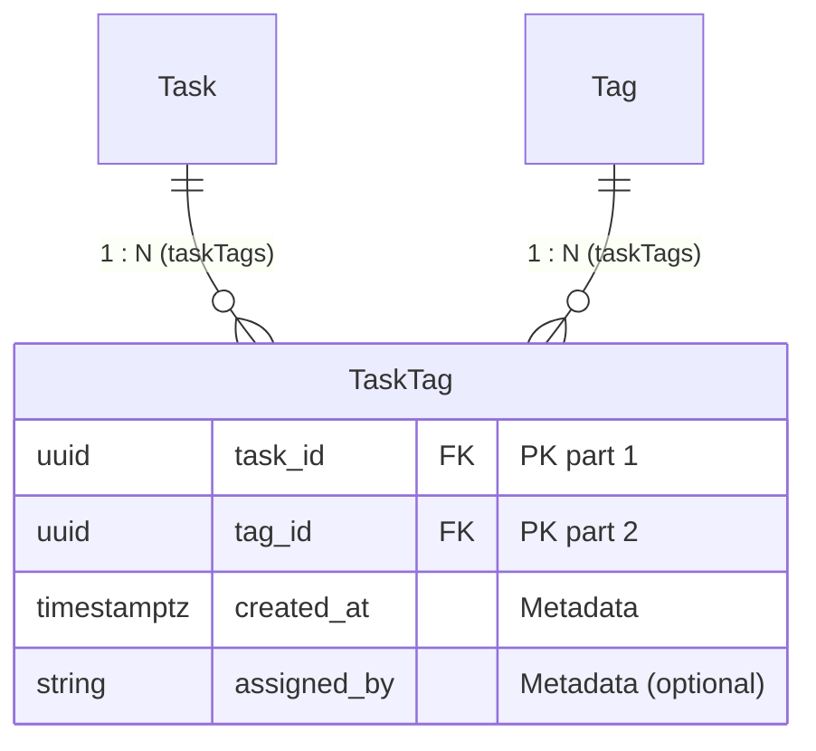

# Guide: Defining Entity Relationships & Explicit Pivot Entities in MikroORM

This guide establishes the workspace standard for modeling entity relationships in **MikroORM v7** using `defineEntity` and the `p` property builder API. It details why **explicit pivot entities** (Approach 1) are the designated pattern for Many-to-Many relationships and provides end-to-end implementation and querying patterns.

---

## 1. Core Philosophy: Explicit Over Magic

Modern MikroORM entities in this workspace avoid decorator magic and implicit database structures.

| Concept | Implicit / Legacy Decorators (Discouraged) | Modern Explicit Standard (Workspace Mandate) |
| :--- | :--- | :--- |
| **Entity Definition** | Class `@Entity()` + `@Property()` decorators | `defineEntity()` + `p` builder + `InferEntity` |
| **Many-to-Many** | `@ManyToMany()` / `p.manyToMany()` with hidden join table | **Explicit Pivot Entity** via two `1:N` relationships (`TaskTag`) |
| **Foreign Keys** | Implicit auto-generated column names | Explicit `.fieldName('user_id')` and `.deleteRule('cascade')` |

---

## 2. Cardinalities & Modern `defineEntity` Builders

### A. One-to-Many & Many-to-One (1:N / N:1)

The foreign key column always resides on the child/owning entity (`manyToOne`). The parent entity defines the inverse collection (`oneToMany`).

```typescript
// src/user/user.entity.ts (Parent / Inverse Side)
import { defineEntity, p, type InferEntity } from '@mikro-orm/core';
import { Project } from '../project/project.entity';

export const User = defineEntity({
  name: 'User',
  tableName: 'users',
  properties: {
    id: p.uuid().primary(),
    emailId: p.string().fieldName('email_id').length(255).unique(),
    
    // Inverse side: Points to the 'user' property on Project
    projects: p.oneToMany(() => Project).mappedBy('user'),
  },
});

export type IUser = InferEntity<typeof User>;
```

```typescript
// src/project/project.entity.ts (Child / Owning Side)
import { defineEntity, p, type InferEntity } from '@mikro-orm/core';
import { User } from '../user/user.entity';

export const Project = defineEntity({
  name: 'Project',
  tableName: 'projects',
  properties: {
    id: p.uuid().primary(),
    name: p.string().length(255),

    // Owning side: Owns foreign key column 'user_id'
    user: p
      .manyToOne(() => User)
      .fieldName('user_id')
      .inversedBy('projects')
      .deleteRule('cascade'), // PostgreSQL ON DELETE CASCADE
  },
});

export type IProject = InferEntity<typeof Project>;
```

---

### B. One-to-One (1:1)

One entity is marked with `.owner()` and holds the foreign key column.

```typescript
// src/user/user-profile.entity.ts (Owning Side)
import { defineEntity, p, type InferEntity } from '@mikro-orm/core';
import { User } from './user.entity';

export const UserProfile = defineEntity({
  name: 'UserProfile',
  tableName: 'user_profiles',
  properties: {
    id: p.uuid().primary(),
    bio: p.string().nullable(),

    // Owns user_id foreign key with unique constraint
    user: p
      .oneToOne(() => User)
      .owner()
      .fieldName('user_id')
      .inversedBy('profile')
      .deleteRule('cascade'),
  },
});

export type IUserProfile = InferEntity<typeof UserProfile>;
```

```typescript
// src/user/user.entity.ts (Inverse Side)
export const User = defineEntity({
  name: 'User',
  tableName: 'users',
  properties: {
    id: p.uuid().primary(),
    // Inverse side: references 'user' property on UserProfile
    profile: p
      .oneToOne(() => UserProfile)
      .mappedBy('user')
      .nullable(),
  },
});
```

---

## 3. Many-to-Many via Explicit Pivot Entities (The Workspace Standard)

### Why Implicit Pivot Tables are Anti-Patterns in Production

1. **No Pivot Metadata**: Implicit pivot tables (`p.manyToMany` with auto-generated tables) cannot hold additional attributes (e.g. `createdAt`, `assignedBy`, `role`, `sortOrder`). Adding them later requires high-risk database migrations and breaking code changes.
2. **Hidden Database Schemas**: Implicit join tables hide foreign key indexes, constraints, and cascade behaviors.
3. **Difficult Direct Querying**: You cannot directly query or paginate the association rows without joining both large parent tables.

---

### Standard Implementation: Decomposing N:M into Two 1:N Relations



#### 1. The Explicit Pivot Entity (`task-tag.entity.ts`)

```typescript
import { defineEntity, p, type InferEntity } from '@mikro-orm/core';
import { Task } from './task.entity';
import { Tag } from '../tag/tag.entity';

export const TaskTag = defineEntity({
  name: 'TaskTag',
  tableName: 'task_tags',
  // Composite primary key (task_id, tag_id)
  primaryKeys: ['task', 'tag'],
  properties: {
    task: p
      .manyToOne(() => Task)
      .fieldName('task_id')
      .inversedBy('taskTags')
      .deleteRule('cascade'),

    tag: p
      .manyToOne(() => Tag)
      .fieldName('tag_id')
      .inversedBy('taskTags')
      .deleteRule('cascade'),

    // ✨ Pivot Payload / Metadata columns
    createdAt: p
      .datetime()
      .fieldName('created_at')
      .columnType('timestamptz'),

    assignedBy: p
      .string()
      .fieldName('assigned_by')
      .length(255)
      .nullable(),
  },
});

export type ITaskTag = InferEntity<typeof TaskTag>;
```

#### 2. The Task Entity (`task.entity.ts`)

```typescript
import { defineEntity, p, type InferEntity } from '@mikro-orm/core';
import { TaskTag } from './task-tag.entity';
import { User } from '../user/user.entity';

export const Task = defineEntity({
  name: 'Task',
  tableName: 'tasks',
  properties: {
    id: p.uuid().primary(),
    title: p.string().length(255),
    user: p
      .manyToOne(() => User)
      .fieldName('user_id')
      .deleteRule('cascade'),

    // OneToMany link to explicit pivot entity
    taskTags: p.oneToMany(() => TaskTag).mappedBy('task'),
  },
});

export type ITask = InferEntity<typeof Task>;
```

#### 3. The Tag Entity (`tag.entity.ts`)

```typescript
import { defineEntity, p, type InferEntity } from '@mikro-orm/core';
import { TaskTag } from '../task/task-tag.entity';
import { User } from '../user/user.entity';

export const Tag = defineEntity({
  name: 'Tag',
  tableName: 'tags',
  properties: {
    id: p.uuid().primary(),
    name: p.string().length(50),
    user: p
      .manyToOne(() => User)
      .fieldName('user_id')
      .deleteRule('cascade'),

    // OneToMany link to explicit pivot entity
    taskTags: p.oneToMany(() => TaskTag).mappedBy('tag'),
  },
});

export type ITag = InferEntity<typeof Tag>;
```

---

## 4. Working with Explicit Pivot Entities at Runtime

### A. Creating an Association with Metadata

```typescript
// Inject EntityRepository<ITaskTag> and EntityManager
const task = await this.taskRepo.findOneOrFail({ id: taskId });
const tag = await this.tagRepo.findOneOrFail({ id: tagId });

// Create the explicit pivot record with metadata
const taskTag = this.taskTagRepo.create({
  task,
  tag,
  assignedBy: currentUserId,
  createdAt: new Date(),
});

await this.em.flush();
```

---

### B. Populating and Reading Related Data

Use nested dot notation in `populate` to retrieve the pivot rows and target entities in a single clean query:

```typescript
const taskWithTags = await this.taskRepo.findOne(
  { id: taskId },
  {
    populate: ['taskTags.tag'], // Populates pivot rows AND nested tag entities
  },
);

// Accessing metadata and related tags cleanly
for (const taskTag of taskWithTags.taskTags) {
  console.log(`Tag Name: ${taskTag.tag.name}`);
  console.log(`Assigned At: ${taskTag.createdAt}`);
  console.log(`Assigned By: ${taskTag.assignedBy}`);
}
```

---

### C. Finding All Tasks Associated with a Specific Tag

Because `TaskTag` is a first-class entity, you can query it directly without expensive full-table joins:

```typescript
const taskTags = await this.taskTagRepo.find(
  { tag: tagId },
  {
    populate: ['task'],
    orderBy: { createdAt: 'DESC' },
  },
);

const tasks = taskTags.map((tt) => tt.task);
```

---

### D. Removing an Association

To unlink a tag from a task, delete the pivot row directly without modifying or deleting the `Task` or `Tag`:

```typescript
const link = await this.taskTagRepo.findOne({
  task: taskId,
  tag: tagId,
});

if (link) {
  await this.em.removeAndFlush(link);
}
```

---

## 5. Summary Reference Cheat Sheet

| Task | Pattern / Code |
| :--- | :--- |
| **Many-to-One** | `p.manyToOne(() => Parent).fieldName('parent_id').inversedBy('children').deleteRule('cascade')` |
| **One-to-Many** | `p.oneToMany(() => Child).mappedBy('parent')` |
| **One-to-One (Owner)** | `p.oneToOne(() => Target).owner().fieldName('target_id').deleteRule('cascade')` |
| **One-to-One (Inverse)**| `p.oneToOne(() => Target).mappedBy('source').nullable()` |
| **Many-to-Many Pivot** | Dedicated `defineEntity({ primaryKeys: ['left', 'right'], properties: { ... } })` |
| **Populate Relation** | `this.repo.find(..., { populate: ['taskTags.tag', 'user'] })` |
