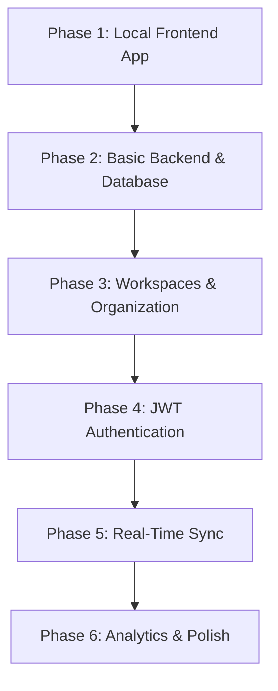

# ZenTodo: Phased Implementation & Learning Plan

To ensure a smooth, sustainable learning curve and avoid overwhelm, we will build ZenTodo in **six distinct, iterative phases**. Each phase will deliver a fully functional, shippable application that builds incrementally on the previous one.

---

---

## Phase 1: Minimalist Local Todo App (Frontend Only)
*Focus: Mastering React, TypeScript, and Chakra UI layouts.*

- **Goals**: 
  - Build a beautiful, responsive task manager that runs completely in the browser.
  - Persist tasks using standard `localStorage` (no database or API yet).
- **Core Features**:
  - Main task list with inline creation.
  - Chakra UI theme setups (Dark/Light mode support).
  - Toggling status, editing task titles, and deleting tasks.
  - Clean layout: header, sidebar (static placeholders for now), and task list.
- **Key Concepts Learned**:
  - React Component structure and TypeScript interfaces.
  - React state hooks (`useState`, `useEffect`).
  - Chakra UI design tokens (spacing, color palettes, responsive flexboxes).

---

## Phase 2: Simple Backend & Database Connection
*Focus: Connecting a NestJS REST API to a PostgreSQL database.*

- **Goals**:
  - Transition from local browser storage to a server-side PostgreSQL database.
- **Core Features**:
  - A NestJS backend with a single `Task` module.
  - A TypeORM configuration connecting to a local PostgreSQL instance.
  - REST API endpoints: `GET /tasks`, `POST /tasks`, `PATCH /tasks/:id`, `DELETE /tasks/:id`.
  - Frontend integration: Swapping local storage handlers with `fetch` or `axios` calls to the NestJS API.
- **Key Concepts Learned**:
  - NestJS modular architecture (Modules, Controllers, Services, Dependency Injection).
  - TypeORM basic Entity definitions and repositories.
  - CORS (Cross-Origin Resource Sharing) headers.
  - Asynchronous data fetching in React with clean loading/error states.

---

## Phase 3: Workspaces & Organization (Relational Data)
*Focus: Managing database relationships and sidebar navigation.*

- **Goals**:
  - Add organization by grouping tasks into custom "Workspaces" (e.g., Personal, Work, Side Project).
- **Core Features**:
  - Database schema expansion (adding `Workspace` entity linked to `Task` as a 1-to-many relationship).
  - Side navigation updating dynamically with active workspaces.
  - Creating, updating, and deleting workspaces.
  - Drag-and-drop support (`@hello-pangea/dnd`) to reorder tasks within a workspace.
- **Key Concepts Learned**:
  - TypeORM relations (`@ManyToOne`, `@OneToMany`) and query joins.
  - Dynamic sidebar routing/state management in React.
  - Implementing accessible Drag and Drop workflows.

---

## Phase 4: User Authentication & Security
*Focus: Securing routes and building multi-user support.*

- **Goals**:
  - Protect user data and support multiple accounts.
- **Core Features**:
  - Sign-up and login screens in the frontend.
  - Backend user authentication (Passport.js, JWT tokens, password hashing with bcrypt).
  - Middleware guards to ensure users can only access their own workspaces/tasks.
  - Storing and passing JWT headers on frontend requests.
- **Key Concepts Learned**:
  - Authentication flow (sessionless JWT verification).
  - Cryptographic password hashing best practices.
  - React Context to hold and distribute `AuthContext` (logged-in user information).
  - Protected routing in React.

---

## Phase 5: Real-Time Synchronization (WebSockets)
*Focus: Bidirectional communication and instant state propagation.*

- **Goals**:
  - Allow real-time task updates across multiple browser tabs/devices.
- **Core Features**:
  - NestJS WebSockets Gateway (`Socket.io`) authenticated with JWTs.
  - Workspace rooms: clients join a Room corresponding to their active Workspace.
  - Live event broadcasting: when User A updates/moves a task, User B's screen updates instantly.
- **Key Concepts Learned**:
  - WebSockets protocols vs. HTTP polling.
  - NestJS Gateways and WebSocket Guards.
  - Managing connection events, reconnections, and race conditions in React.

---

## Phase 6: Analytics Dashboard & Polish
*Focus: Data visualization and high-fidelity UX detailing.*

- **Goals**:
  - Highlight progress and add visual polish.
- **Core Features**:
  - Analytics Dashboard with interactive productivity graphs (`Recharts`).
  - Activity heatmaps (GitHub-style calendar grid).
  - Achievement streaks with visual animations.
  - Micro-animations: page transitions, drag states, custom Chakra skeletons.
- **Key Concepts Learned**:
  - Data aggregation queries in PostgreSQL/TypeORM.
  - Responsive charts integration.
  - Animation principles with Framer Motion.
