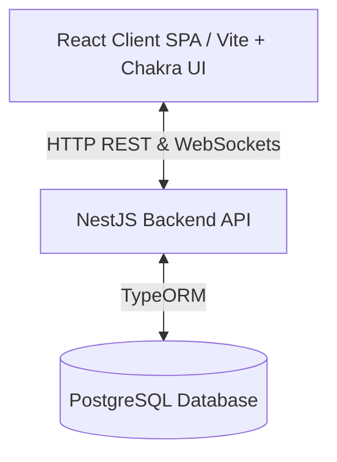
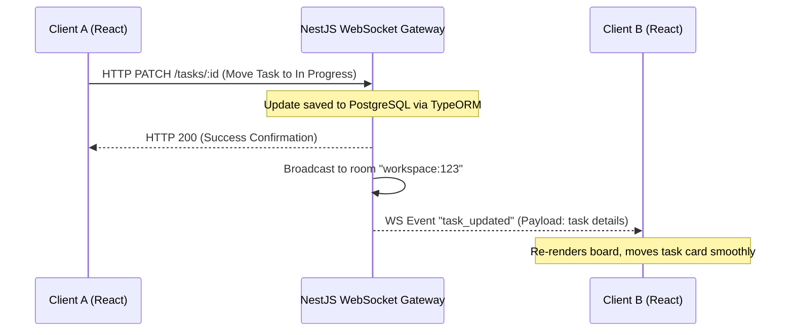

# Product Requirements Document (PRD): ZenTodo

ZenTodo is a premium, state-of-the-art productivity and task management application that blends minimalistic elegance with powerful features like workspace organization, Kanban boards, interactive analytics, and real-time synchronization.

---

## 1. Executive Summary & Vision

Traditional todo apps are either too simple or too cluttered. **ZenTodo** aims to bridge this gap by delivering:
- **Rich Aesthetics**: A visually stunning, responsive interface featuring modern dark modes, fluid micro-animations, glassmorphic elements, and cohesive color schemes built using **Chakra UI**.
- **Diverse Views**: Flexibility to organize tasks via a standard list view, a Kanban board, or a calendar view.
- **Data-Driven Insights**: A personal dashboard tracking completion streaks, productivity heatmaps, and category breakdowns.
- **Real-Time Collaboration**: Collaborative spaces where modifications are pushed instantly to all active workspace participants.

---

## 2. Tech Stack Architecture

The application is structured as a decoupled client-server architecture:



### Frontend (Client)
- **Framework**: React (using Vite)
- **UI Library & Styling**: Chakra UI (for rapid development, responsive designs, dark mode utilities, and cohesive layouts)
- **State Management**: React Context & Hooks (standard state management)
- **Real-Time Gateway Client**: `socket.io-client`
- **Icons**: React Icons (Lucide-React)
- **Drag & Drop**: `@hello-pangea/dnd` or custom lightweight HTML5 drag-and-drop
- **Charts**: `Recharts` for interactive productivity analytics

### Backend (Server)
- **Framework**: NestJS (TypeScript-first, modular architecture)
- **ORM**: TypeORM (Database integration)
- **Real-Time Gateway**: NestJS WebSockets with Socket.io adapter (`@nestjs/websockets`, `@nestjs/platform-socket.io`)
- **Authentication**: Passport.js with JWT strategy, bcrypt for password hashing
- **Validation**: `class-validator` and `class-transformer`

### Database
- **Engine**: PostgreSQL (schema designed independently by user)

---

## 3. Real-Time Synchronization Engine

To ensure instantaneous updates across multiple open clients/devices, ZenTodo implements a full-duplex WebSocket communication pipeline.

### Connection & Lifecycle

1. **Authentication Handshake**:
   - The React client initiates a WebSocket connection (`socket.io-client`) to the NestJS backend gateway.
   - The connection handshake includes the JWT token in the `auth` headers:
     ```javascript
     const socket = io(process.env.API_URL, {
       auth: { token: `Bearer ${jwtToken}` }
     });
     ```
   - A NestJS WebSocket Guard interceptor validates the token. Unauthorized connections are immediately disconnected.

2. **Workspace Room Allocation**:
   - Upon successful authorization, the client automatically requests to join a room corresponding to their active workspaces:
     ```typescript
     @SubscribeMessage('join_workspace')
     handleJoinWorkspace(@MessageBody() workspaceId: string, @ConnectedSocket() client: Socket) {
       client.join(`workspace:${workspaceId}`);
     }
     ```
   - All workspace participants are aggregated into the same namespace.

### Event Dissemination Pipeline

When mutative operations occur, notifications are distributed dynamically:



- **Task Creation (`task_created`)**: Sent to the workspace room when a new task is appended. The UI plays an entry transition.
- **Task Deletion (`task_deleted`)**: Sent to the workspace room. The UI animates the removal of the task card.
- **Task Reordering / Re-categorization (`task_moved`)**: Broadcasts the new task coordinates, column states, and order indexes. Facilitates smooth layout shifts for other users.

---

## 4. Feature Specifications

### 4.1. Authentication & Session Management
- **User Registration**: Sign up with credentials (email, password, name).
- **Session Tokens**: JWT stored securely. Chakra UI auto-detects system themes or allows toggling light/dark modes.

### 4.2. Workspace & Categories
- Custom spaces with unique titles, descriptions, and branding colors.
- Custom categories with select visual icons.

### 4.3. Interactive Task Engine & Views

#### List View
- Interactive tasks with custom sorting (Priority, Due Date, Creation Date).
- Checkboxes with click-and-hold animations or micro-transitions upon toggling.
- Detailed Drawer: Sliding Chakra UI `Drawer` that reveals task properties:
  - Rich Markdown support inside the task description (e.g., rendering code snippets, bold lists).
  - Subtask checklists: Interactive checklist where status bar updates dynamically:
    $$\text{Completion Ratio} = \frac{\text{Completed Subtasks}}{\text{Total Subtasks}} \times 100$$
  - Tags and priority badges.

#### Kanban Board View
- Grid layout comprising three distinct status columns: `Todo`, `In Progress`, and `Done`.
- Drag-and-drop support: Dragging cards between columns initiates a visual tilt transition.
- **Optimistic UI Updates**: The card instantly drops in the target column while the background socket/HTTP request updates PostgreSQL. If the request fails, the card reverts with a shake animation.

#### Calendar View
- Modern interactive calendar grid displaying tasks as small badges on due date cells.
- Monthly / Weekly view toggles.
- Drag tasks between date cells to automatically update the task's due date.

---

## 5. Productivity Dashboard & Analytics

The Dashboard aggregates metrics using analytical charts:

### 5.1. Summary Stats (KPI Cards)
- **Completion Rate**: Dynamic percentage gauge of tasks completed versus tasks assigned.
- **Productivity Streak**: Consecutively logged days with at least 1 task marked completed. When the streak increases, the count animates with a "fire" 🔥 spark.
- **Estimated Completion Velocity**: Average duration (in hours) between task creation and mark-as-done state.

### 5.2. Visual Analytics
- **Completion Heatmap**: A Github-style grid mapping activity intensity over the year (darker green/blue indicators for higher numbers of completed tasks on a specific day).
- **Task Distribution by Category**: A Chakra-themed `Recharts` Donut Chart representing task allocation among categories.
- **Weekly Load Chart**: Line charts contrasting Created vs. Completed tasks to help users evaluate load balance.

---

## 6. Design & User Experience (UX) using Chakra UI

We harness Chakra UI's modern system design tokens:
- **Theme**: Dark mode first utilizing `gray.900` or custom charcoal backgrounds (`#0d0e12`).
- **Gradients & Accents**: Electric blue (`cyan.400`), neon purple (`purple.400`), and active green (`emerald.400` or `green.400`) to highlight primary states.
- **Borders & Shadows**: Soft glassmorphism using `backdropFilter="blur(8px)"` combined with translucent borders (`rgba(255,255,255,0.08)`).
- **Transitions**: Native Chakra motion elements (e.g., `Collapse`, `Fade`, `ScaleFade`) paired with custom Framer Motion transitions for smooth interaction speeds.
